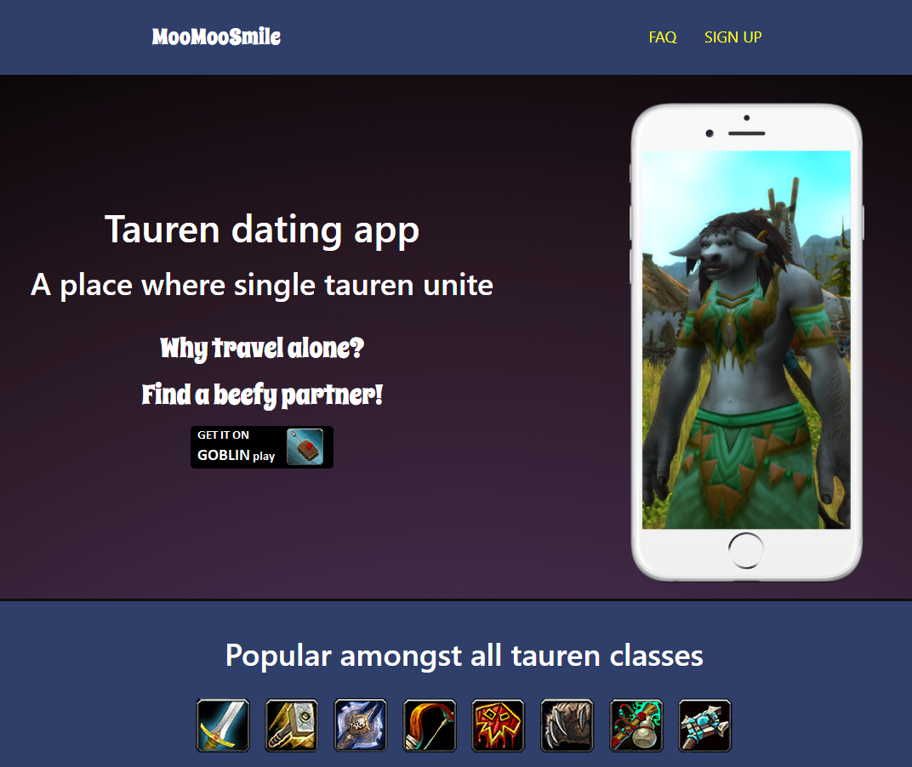
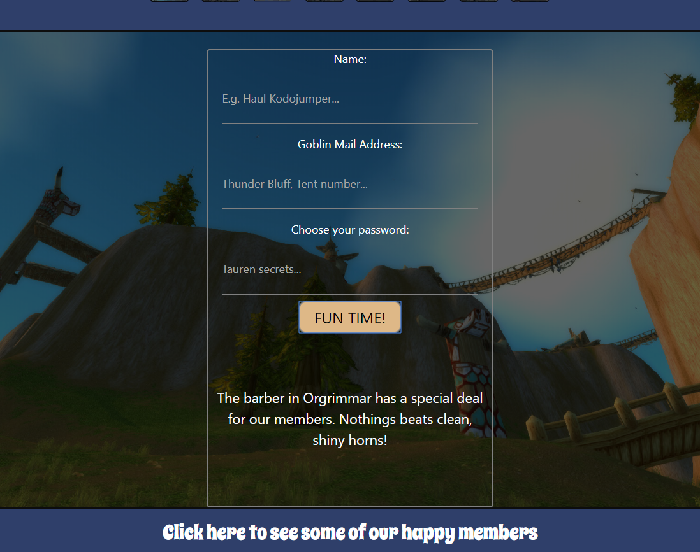
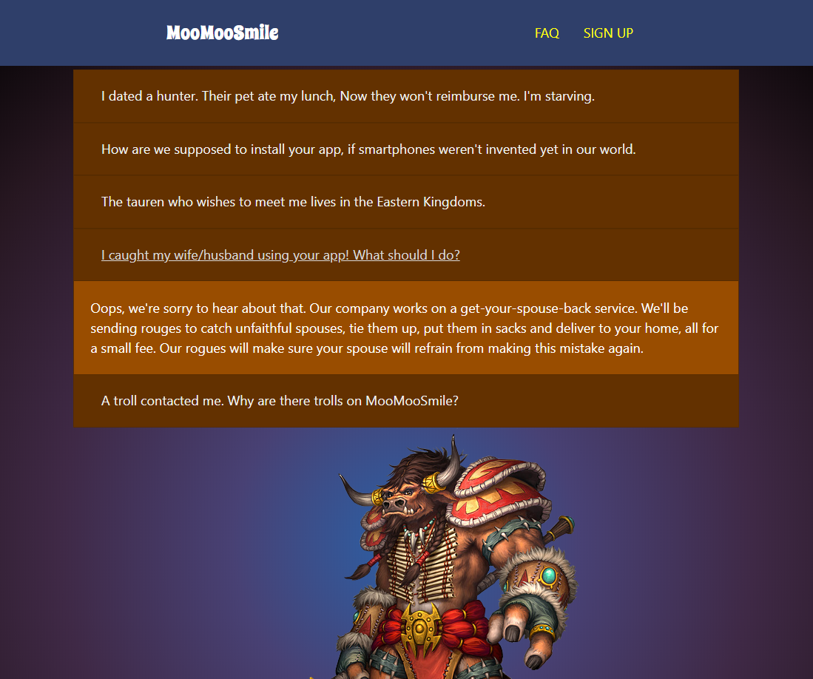

# Link to project
https://wolfenek.github.io/Tauren-Dating-App-Page/

# Screen shots

# Topic

World of Warcraft fan project - Tauren Dating App Landing Page.

# Technologies used

HTML, SCSS, Bootstrap 4, JavaScript, jQuery

# Features

- responsive design
- random quote generator (pieces of advice appear when clicking the 'FUN TIME!' button)
- animated icons on click
- animated background transition
- FAQ section with fun information and more

# About

This is a project made for fun and for the sake of practicing web development.
